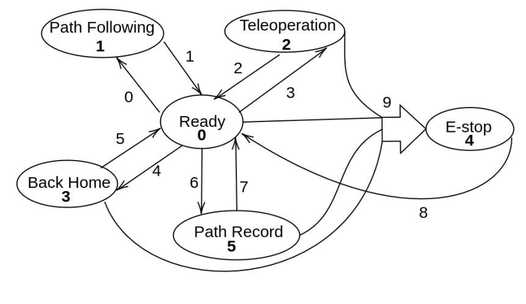

# ARGJ801 CONTROL MISSION ROS2 Package

## Table of Contents
- [Introduction](#introduction)
- [Finite State Machine](#finite-state-machine)
  - [States](#states)
  - [Node Transitions and Lifecycle Management](#node-transitions-and-lifecycle-management)
- [Package Structure](#package-structure)
- [Installation](#installation)
- [Usage](#usage)
- [Contributing](#contributing)
- [License](#license)
- [Additional Documentation](#additional-documentation)

## Introduction

The mission control for the ARGJ801 rover is implemented through a Finite State Machine (FSM). The FSM controls the transitions between different operational states, each corresponding to specific robot behaviors such as teleoperation, autonomous path following, and emergency stop (E-stop). When a transition is called, the FSM deactivates the node(s) associated with the current state and activates the node(s) associated with the next state. The [Lifecycle Nodes](https://design.ros2.org/articles/node_lifecycle) mechanism in ROS2 is used to manage the activation and deactivation of nodes.

## Package Structure

```
argj801_ctl_mission
├── argj801_ctl_mission_interfaces/  # Service definitions
│   ├── srv/  # Service files
│   ├── CMakeLists.txt
│   ├── LICENSE
│   └── package.xml
├── config/  # Configuration files
├── images/  # Images used in documentation
├── launch/  # Launch files
├── scripts/  # Python Scripts
├── src/  # Source code
│   ├── FSM_states/  # State implementations for the FSM
│   ├── controllers/  # Controllers for path following
│   ├── J8_FSM.cpp
│   ├── README.md
│   └── argj08_ctl_node.cpp
├── test/  # Test files
│   └── test_lifecycle.py
├── CMakeLists.txt  # CMake build file
└── package.xml  # Package configuration file
```


## Installation

1. Clone the repository:
    ```bash
    git clone https://github.com/yourusername/arj801_ctl_mission.git
    cd arj801_ctl_mission
    ```

2. Install dependencies:
    ```bash
    rosdep install --from-paths src --ignore-src -r -y
    ```

3. Build the package:
    ```bash
    colcon build
    ```

4. Source the workspace:
    ```bash
    source install/setup.bash


## Finite State Machine

A Finite State Machine, implemented in the file `J8_FSM.cpp`, manages the transitions between various states. These states define the different functionalities of the robot. The FSM ensures that only the nodes relevant to the current state are active, thus optimizing resource usage and ensuring predictable robot behavior.



### States

1. **Ready (State 0)**
    - **Description**: On start-up, the robot transitions to the ready state. In this state, the robot is not able to move and waits for a command to transition to a different state where an active functionality is implemented.
    - **Nodes Active**: 
      - `readyNode`
    - **Transitions To**: Teleoperation, Pathfollowing, BackHome, E-stop, PathRecord

2. **Teleoperation (State 1)**
    - **Description**: In this state, the robot receives and executes velocity commands from a joystick.
    - **Nodes Active**: 
      - `teleoperationNode`
      - `joystickNode`
    - **Transitions To**: Ready,  E-stop

3. **Pathfollowing (State 2)**
    - **Description**: The robot performs a path tracking algorithm using one of the controllers included in the package.
    - **Nodes Active**: 
      - `pathfollowingNode`
      - `MPCPlannerNode`
      - `controllerNode`
    - **Transitions To**: Ready,  E-stop

4. **BackHome (State 3)**
    - **Description**: The robot requests a path from the Control center to return to the predefined GPS coordinates for home.
    - **Nodes Active**: 
      - `backhomeNode`
    - **Transitions To**: Ready,  E-stop

5. **E-stop (State 4)**
    - **Description**: If an error is detected, the robot automatically transitions to this state. The robot is immobilized in this state, and transitions out of E-stop are only possible once the error is resolved.
    - **Nodes Active**: 
      - `estopNode`
    - **Transitions To**: Ready (only after error resolution)

5. **PathRecord (State 5)**
    - **Description**: The robot records the path it traverses.
    - **Nodes Active**: 
      - `pathRecordNode`
    - **Transitions To**: Ready,  E-stop
    
 
A further explanation of the states implementation can be found [here](./ctl_mission/src/FSM_states/README.md).

### Node Transitions and Lifecycle Management

The FSM uses the lifecycle management capabilities of ROS2 to control the states of the nodes. Each state transition involves deactivating the nodes associated with the current state and activating the nodes associated with the next state. This ensures that only the necessary nodes are running, optimizing the system's performance and resource usage.


    

## Usage

The [argoj8_setup package](https://github.com/Robotics-Mechatronics-UMA/argj801_setup), contains the launch and config files to correctly use this pacakge.
## Contributing

We welcome contributions to the ARGJ801 ROS2 package. To contribute, please follow these steps:

1. Fork the repository.
2. Create a new branch from `main`.
3. Make your changes.
4. Submit a pull request to the `main` branch.

### Reporting Issues

If you find a bug or have a feature request, please create an issue on GitHub.

### Coding Standards

Please follow the ROS2 coding standards and ensure your code passes all linting checks.


